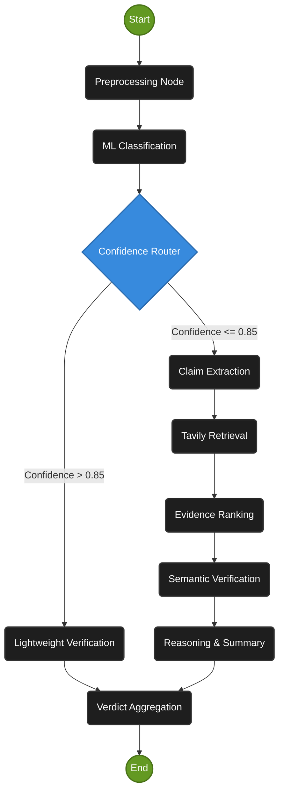

# System Architecture

The News Credibility Analyzer uses **LangGraph** to orchestrate a multi-step, state-driven workflow. The system transitions from a simple ML classifier to a dynamic pipeline capable of deep semantic reasoning and evidence-based fact-checking.

## LangGraph State Flow

## Node Responsibilities

1. **Preprocessing (`preprocessing.py`)**: Cleans input text, removing punctuation and stopwords to prepare it for the legacy Scikit-Learn model.
2. **Classification (`classifier.py`)**: Processes the cleaned text through the pre-trained TF-IDF vectorizer and ML classifier to output a base prediction and probability score.
3. **Confidence Router (`graph_builder.py`)**: A conditional edge that evaluates the ML confidence score. If the score is exceptionally high (default > 0.85), it bypasses the expensive RAG pipeline to save time and tokens.
4. **Lightweight Verification (`lightweight.py`)**: A fast-track LLM node that performs a rapid consistency check on high-confidence ML predictions to catch glaring errors without needing web search.
5. **Claim Extraction (`claim_extractor.py`)**: Uses Groq LLMs to deconstruct the article into atomic, verifiable assertions while explicitly stripping out hedges ("some say") and caveats to ensure strict fact-checking.
6. **Retrieval (`retrieval.py`)**: Queries the Tavily Search API for each extracted claim to pull live web evidence.
7. **Ranking (`ranking.py`)**: Uses the LLM to contextually evaluate and filter the retrieved evidence, retaining only the top-k most highly relevant context chunks for the verification step.
8. **Verification (`verification.py`)**: Performs semantic matching between the atomic claim and the ranked evidence. It enforces strict rules (e.g., numerical mismatches instantly trigger a `FALSE` verdict).
9. **Reasoning (`reasoning.py`)**: Synthesizes the individual claim verifications into a cohesive analysis, identifying primary risk factors and generating a high-level summary.
10. **Verdict (`verdict.py`)**: Employs deterministic Python rules to evaluate the verified claims (e.g., a single `FALSE` claim downgrades the entire article) and outputs the final `MOSTLY TRUE`, `PARTIALLY TRUE`, or `FALSE` credibility score.
